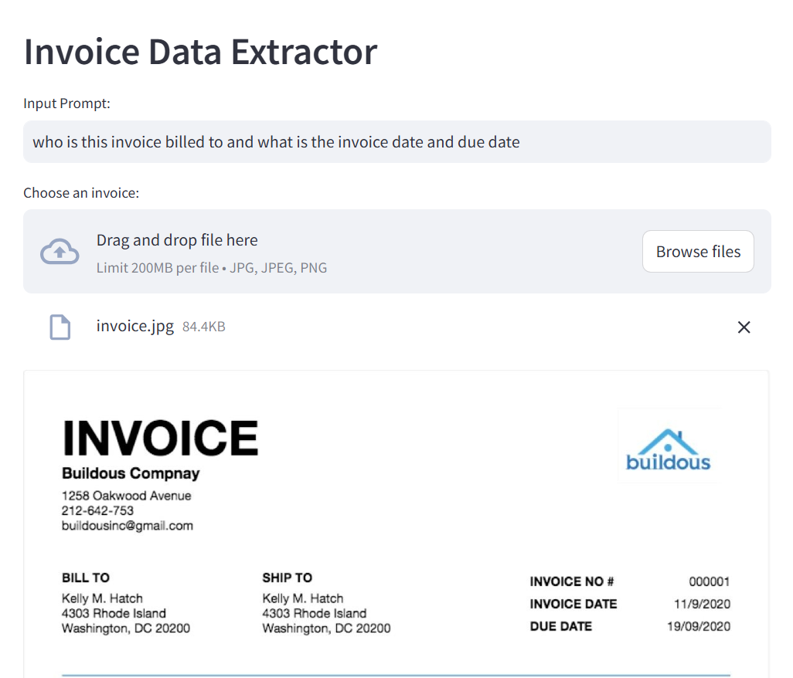
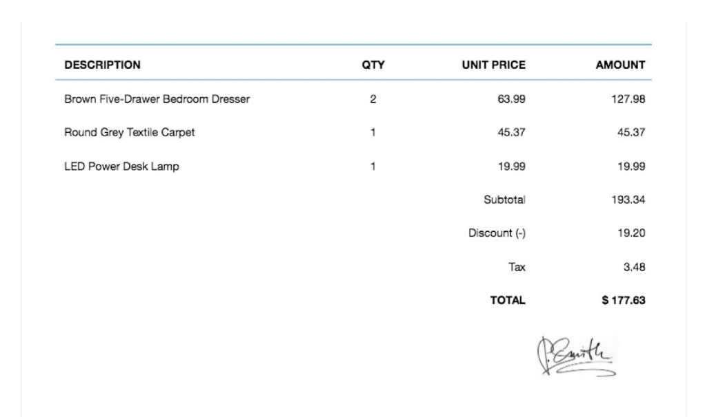
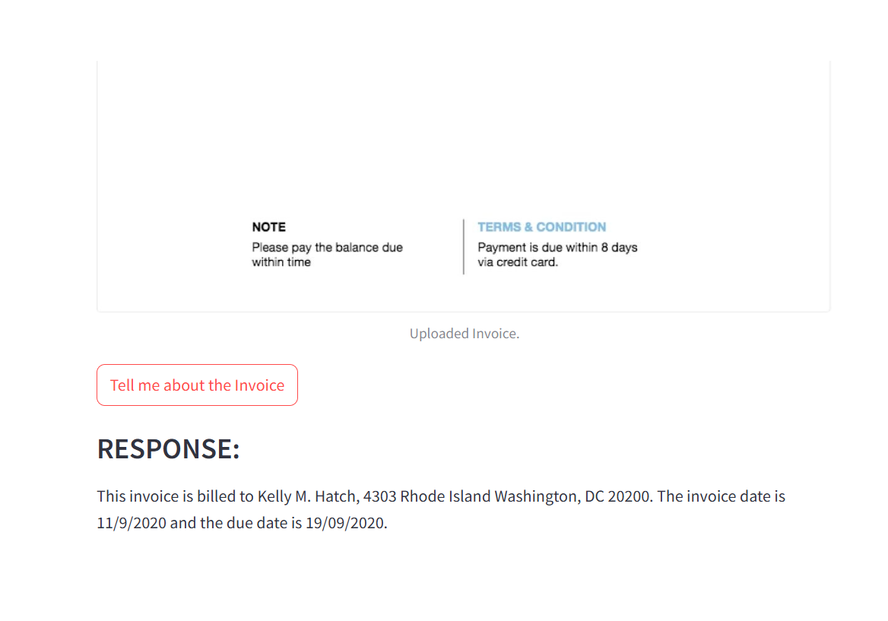

### You can simply put in your `GEMINI_API_KEY` in the `model.py` file to use the streamlit Application.

### Simple Demo:

The input prompt is sent to the model alongside the uploaded invoice.  
The response of the model can be seen at the bottom.

